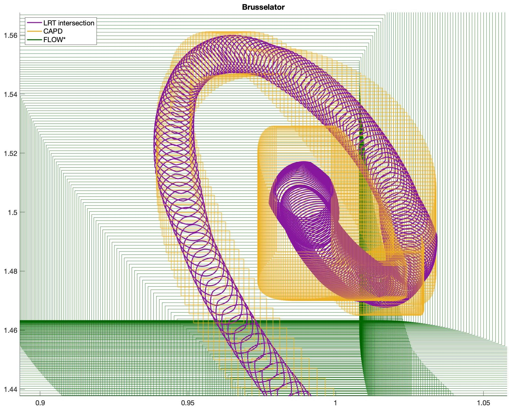

# Lagrangian Reachtubes: The next Generation (LRT-NG)

This is the official code repository of the paper *Lagrangian Reachtubes: The next Generation*
published at Proceedings of the 59th IEEE Conference on Decision and Control (CDC), 2020
([arXiv link](https://arxiv.org/pdf/2012.07458.pdf)). This paper received the **IEEE award**
TC-DES and TC-HS Outstanding Student Paper Prize.

LRT-NG is a toolset that computes a reachtube (an over-approximation of the set of
reachable states over a given time horizon) of continuous-depth neural networks as well as any other
nonlinear dynamical systems.




This document describes the general usage of LRT-NG.

## Setup
<details>
    <summary><b>Click to expand and see the requirements and installation of LRT-NG</b></summary>

### Requirements

#### Ibex
Download file from [Ibex](http://www.ibex-lib.org),
create ibex directory, unpack downloaded file there, configure and install it:
```
curl http://www.ibex-lib.org/ibex-2.7.4.tgz --output ibex-2.7.4.tar.gz
tar xvfz ibex-2.7.4.tar.gz
cd ibex-2.7.4
sudo ./waf configure --interval-lib=filib
sudo ./waf install
```

#### Eigen
Eigen is a C++ template library for linear algebra: matrices, vectors, numerical solvers, and related algorithms.

If you just want to use Eigen, you can use the header files right away.
There is no binary library to link to, and no configured header file.
Eigen is a pure template library defined in the headers.
```
git clone https://gitlab.com/libeigen/eigen.git /usr/local/include/eigen3
```

#### Boost
The program_options library allows program developers to obtain program options,
that is (name, value) pairs from the user, via conventional methods such as command line and config file.

Download via package manager:

**Linux**
```
sudo apt-get install libboost-all-dev
```

**Mac Os X** using [Homebrew](https://brew.sh)
```
brew install boost
```

#### CMake
Download via package manager:

**Linux**
```
sudo apt-get install cmake
```

**Mac Os X** using [Homebrew](https://brew.sh)
```
brew install cmake
```


### Download & Installation
Clone this repository and use cmake to compile the code.
```
cd ~/
git clone git@github.com:DatenVorsprung/LRTNG.git
cd LRTNG
cmake ./
make all
```
</details>

## Benchmarks
To specify a model, e.g. brusselator, you need to create the files *brusselator_fdyn.txt* and *brusselator_init.txt* in  
the folder [Benchmarks](Benchmarks). In the
*_fdyn.txt* file you define the nonlinear dynamical system function and in the *_init.txt* file,
you specify some model-specific arguments:

- ```dimension``` dimension of the nonlinear dynamical system

- ``ìnitial_radius`` radius $\delta_0$ of the initial ball

- ```last_variable_is_time_t(boolean)``` If your benchmark has time as a variable (like our
  [Dubins Car](Benchmarks/dubins_init.txt)), put the time variable as the last one and set this argument to 1, otherwise 0
    
- ```control_variables_without_radius_(last_ones_except_time_variable)``` If your benchmark has control variables
  or other variables whose value should be initialized by an exact value (without putting a ball around it),
  put them as the last ones (before time variable) and set this argument to the number of those variables. Example:
  [Quadcopter](Benchmarks/quadcopter_init.txt)

- ``initial_values`` center $x_0$ of the initial ball

All models used in our paper are in the folder [Benchmarks](Benchmarks), so you can try them out before running LRT-NG with
your own models.
For example,
```c++
// cartpole_fdyn.txt (CartPole-v1 with a linear policy)
Function fdyn(dth, dx, th, x)
    M = 1.0;
    g = 9.81;
    h = 0.0001;
    l = 1.0;
    m = 0.001;


    f = -1.1 * M * g * th - dth;

    fdth = 1.0 / (l*(M+m*sin(th)*sin(th))) * (f * cos(th) - m*l*dth*dth*cos(th)*sin(th) + (m+M)*g*sin(th));
    fdx = 1.0 / (M+m*sin(th)*sin(th)) * ( f + m*sin(th) * (-l * dth*dth + g*cos(th)) );

    fx = dx;

    fth = dth;

    return (fdth, fdx, fth, fx);
end

// cartpole_init.txt (CartPole-v1 with a linear policy)
Cartpole
********************
dimension:
4
********************
initial_radius:
0.01
********************
last_variable_is_time_t(boolean):
0
********************
control_variables_without_radius_(last_ones_except_time_variable):
0
********************
initial_values:
dth,dx,th,x
0
0
0.001
0
```

## Running LRT-NG
The entry point of LRT-NG is defined in the file main.cpp, which accepts several arguments to specify properties of the
reachtube. The most notable arguments are:

| argument | description | default value |
| --------- | ---------- | ------------ |
| ```--help``` | produce help message | false |
| ```--benchmark``` | choose benchmark | bruss |
| ```--time_horizon```| set time horizon T | 10 |
| ```--time_step``` | set time step dt | 0.01 |
| ```--integration_order``` | Runge-Kutta integration order (1, 2 or 4) | 1 |
| ```--compute_volume``` | compute and output volume of Reachtube (bool) | 1 |
| ```--print_output``` | print output to console (bool) | 1 |


You can use the [run.sh](run.sh) script to define the parameters and use it
to run several models or distinct settings consecutively:
```
./run.sh
```

## Plotting the Reachtube
There are several *_output.txt* files in [saved_outputs](saved_outputs).
You can plot the reachtube by running [plot_LRTNG.py](plot_results/plot_LRTNG.py) using the
*_ellipse_output.txt* and *_circle_output.txt* files.

### Setup
```bash
cd plot_results
python3 -m venv venv      # Optional
source venv/bin/activate  # Optional
python3 -m pip install -r requirements.txt
```

### Plotting
The entry point of plotting is defined in the file [plot_LRTNG.py](plot_results/plot_LRTNG.py), which accepts several arguments
to specify properties. The required arguments are:

| argument | description |
| --------- | ---------- |
| ```--dim``` | dimension of the nonlinear dynamical system |
| ```--time_horizon```| time horizon T of plot |
| ```--time_step``` | used time step dt |
| ```--ellipse_file``` | name of the ellipse file inside --output_directory |
| ```--circle_file``` | name of the circle file inside --output_directory |


The last lines of the terminal output after running the code shows how to plot that specific Reachtube.
For example:
````bash
cd plot_results
source venv/bin/activate
python plot_LRTNG.py --dim 2 --time_horizon 10 --time_step 0.01 --circle_file 1636844712_circle_output.txt --ellipse_file 1636844712_ellipse_output.txt
deactivate
cd ..
````

## Volume
The number of successful iterations made and the volume of the reach-sets is saved in *_volume_output.txt* file
inside [saved_outputs](saved_outputs) as well as part of the terminal output:
```
Volume after 1001 iterations:

Average Volume:	1.1138057e-07

Initial Volume:	3.0842514e-09

Final Volume:	4.0225955e-07
```

## Citation

```bibtex
@INPROCEEDINGS{gruenbacher2020lagrangian,
  author={Gruenbacher, Sophie and Cyranka, Jacek and Lechner, Mathias and Islam, Md Ariful and Smolka, Scott A. and Grosu, Radu},
  booktitle={CDC}, 
  title={Lagrangian Reachtubes: The Next Generation}, 
  year={2020},
  pages={1556-1563},
  }
```
